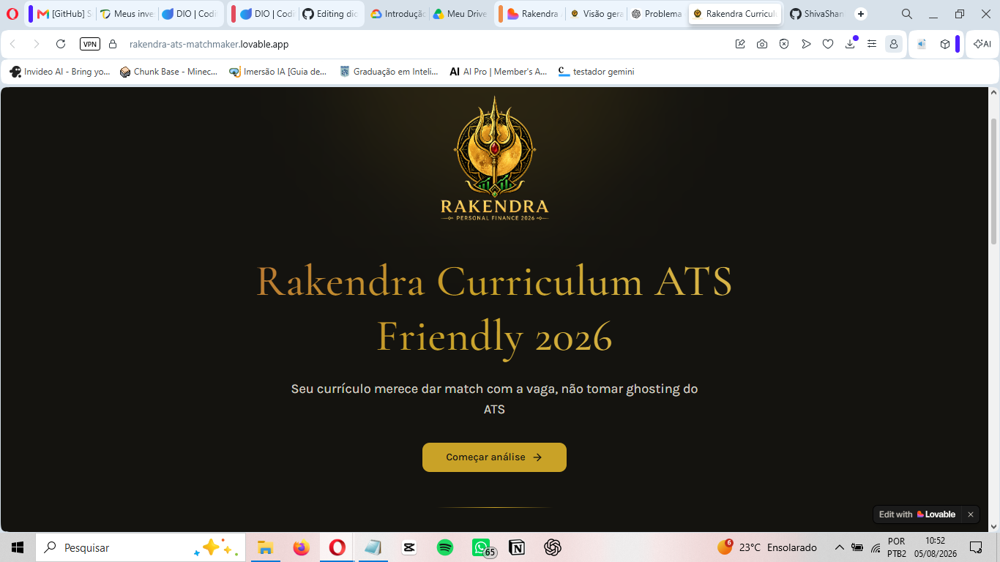
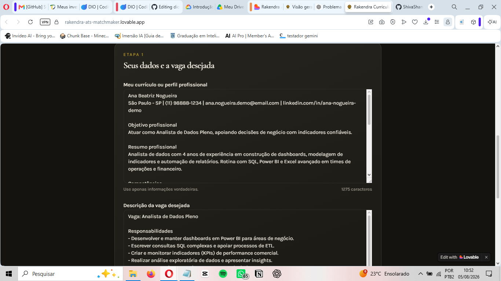
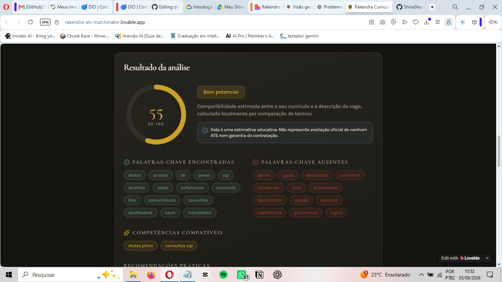
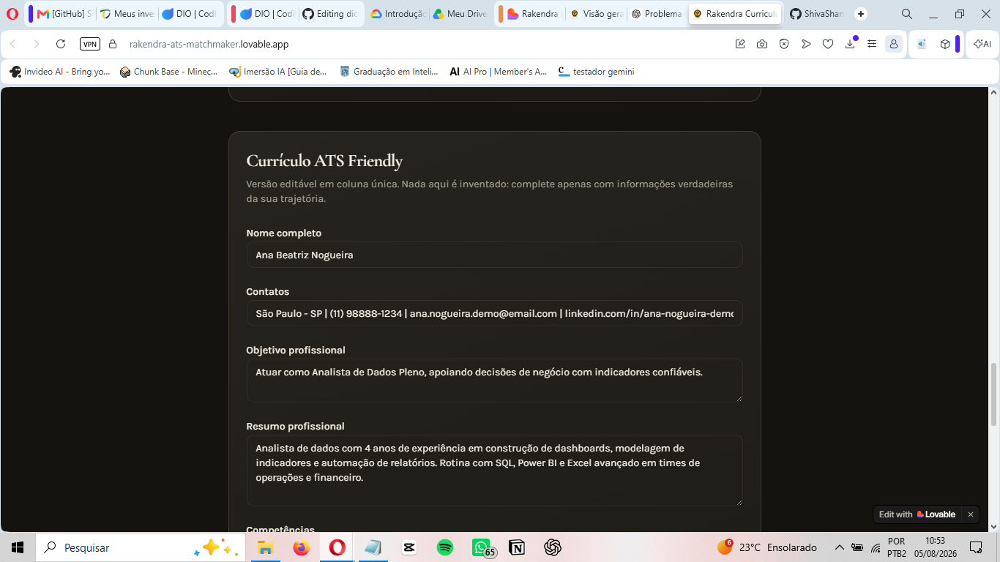
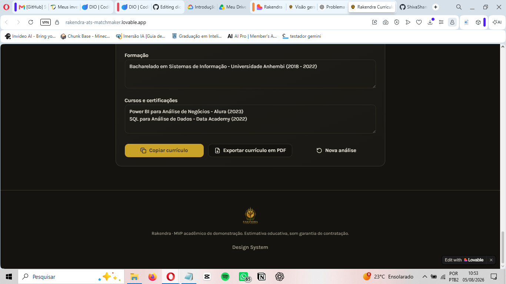
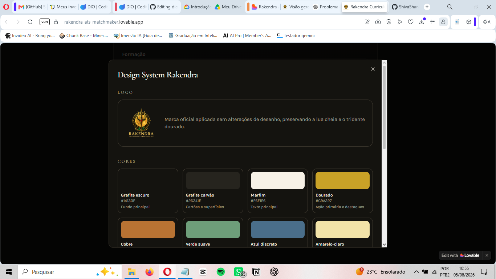

# Rakendra Curriculum ATS Friendly 2026

Aplicação web criada com Lovable e princípios de Vibe Coding para comparar currículos com vagas de emprego e gerar versões mais compatíveis com sistemas ATS.

> Status atual: MVP publicado e documentado.

## Aplicativo publicado

**https://rakendra-ats-matchmaker.lovable.app**

## Origem e referência

Este projeto integra o mesmo percurso formativo da Digital Innovation One, DIO, utilizado no desenvolvimento do Rakendra Personal Finance 2026.

Projeto-base de organização documental: https://github.com/ShivaShankaraBr/dio-lab-vibe-coding-app-financas

Aplicação de referência apresentada pelo professor: https://matchoughost.lovable.app/

O Rakendra Curriculum ATS Friendly 2026 é uma implementação própria, com identidade, documentação, fluxos e decisões de produto adaptados ao desafio.

## Objetivo

Permitir que o usuário cole seu currículo ou perfil profissional e a descrição de uma vaga para:

- calcular uma compatibilidade estimada;
- identificar palavras-chave encontradas e ausentes;
- apontar competências aderentes e oportunidades de melhoria;
- gerar uma versão editável do currículo adaptada à vaga;
- exportar o currículo em PDF com estrutura ATS Friendly;
- consultar e exportar o design system da aplicação em PDF.

## Escopo do MVP

- uso direto, sem login;
- análise local ou simulada, sem chave de API;
- campos para currículo e descrição da vaga;
- pontuação de compatibilidade de 0 a 100;
- recomendações claras e honestas;
- currículo gerado sem inventar experiências ou competências;
- edição do conteúdo antes da exportação;
- exportação do currículo em PDF;
- página de design system com exportação em PDF;
- interface responsiva construída com shadcn/ui;
- identidade visual inspirada na Rakendra.

## Identidade visual

A aplicação utiliza grafite, marfim, dourado ou cobre e verde suave como base. Azul discreto e amarelo-claro aparecem somente em informações, indicadores e pequenos detalhes. O logotipo oficial da Rakendra deve ser utilizado sem deformação e sempre preservando a lua cheia.

## Tecnologias previstas

- Lovable;
- React;
- TypeScript;
- Tailwind CSS;
- shadcn/ui;
- armazenamento local do navegador;
- biblioteca de geração de PDF compatível com o projeto.

## Documentação

- [PRD](PRD-Rakendra-Curriculum-ATS-Friendly-2026.md)
- [Prompt mestre para o Lovable](PROMPT-MESTRE-LOVABLE-Rakendra-Curriculum-ATS-Friendly-2026.md)
- [Reflexão sobre o processo](REFLEXAO.md)

## Capturas do aplicativo

### Tela inicial

### Entrada de currículo e vaga

### Resultado da análise ATS

### Currículo ATS Friendly editável

### Ações do currículo

### Design System

## Testes e limitações observadas

Foram realizados testes manuais de navegação com o exemplo demonstrativo, incluindo o preenchimento dos campos, a análise de compatibilidade, a visualização das palavras-chave, a edição do currículo e a abertura do Design System.

O MVP apresenta os botões de copiar currículo e exportar currículo em PDF. A confirmação completa da geração dos arquivos não foi registrada nas capturas desta entrega.

Como os créditos gratuitos do Lovable foram encerrados, não foram feitos novos ajustes. A assinatura “Personal Finance 2026” ainda aparece no logo utilizado pelo aplicativo e pertence ao projeto anterior; este é um detalhe visual pendente, sem impacto no fluxo principal demonstrado.

## Autor

**Luiz Henrique Camacho Correra (Shiva Shankara)**

Graduando em Tecnologia em Inteligência Artificial e fundador do Instituto Rakendra.

## Licença

Projeto desenvolvido para fins educacionais e de demonstração.
